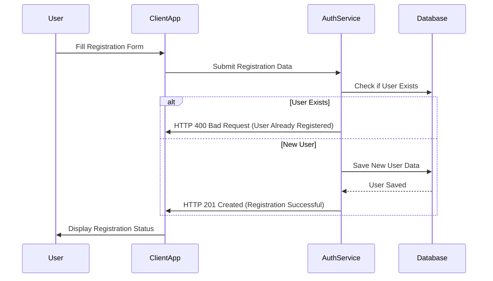
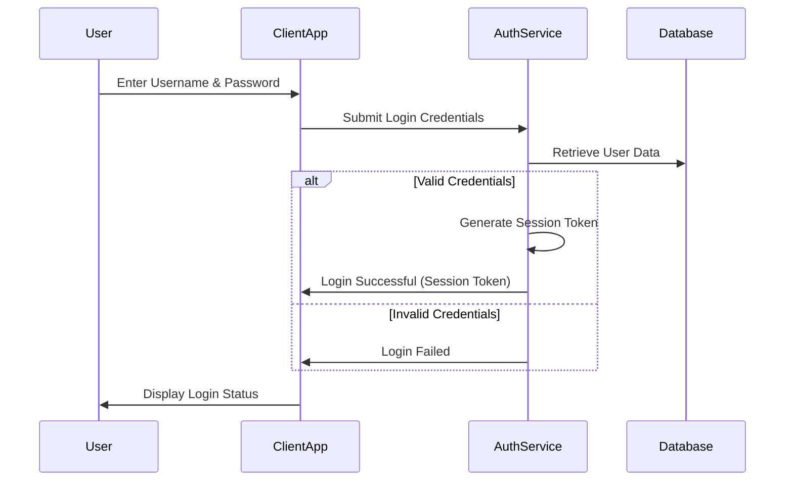
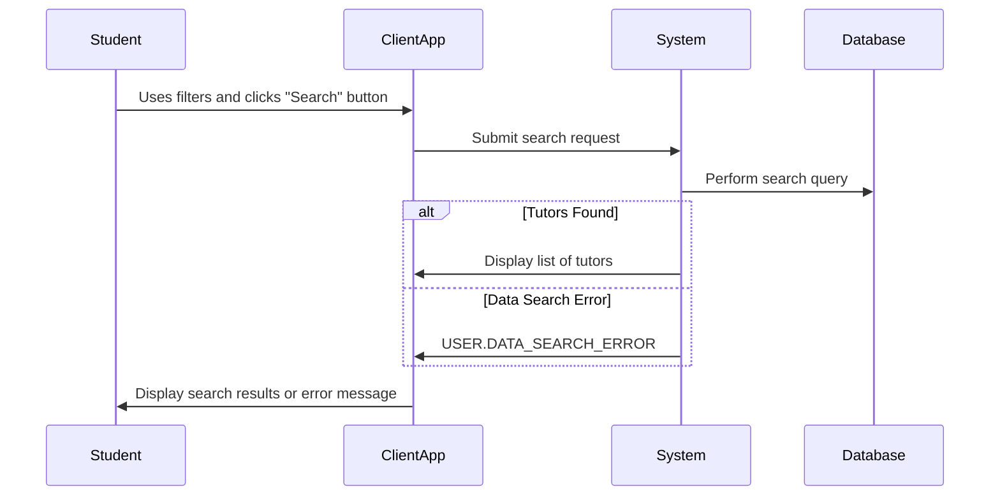
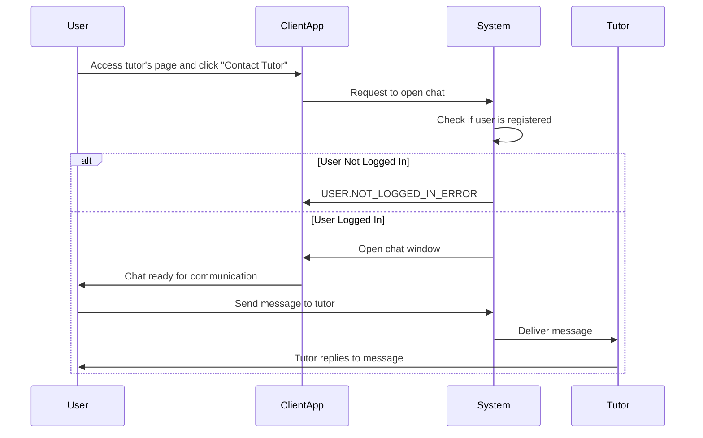

## Use cases

### Student Sequence Diagrams

#### Student Registration
@startuml
|Student|
start
:Goes to the registration page;
:Indicates the type of user - Student;
:Enters registration data \n(name, email, password, phone number);

|System|
:Checks for correctness\nentered data;
note right #ff8c69
Possible USER.REGISTRATION_ERROR
end note
:Creates a new account for the user;

|Student|
:Receives confirmation\nabout successful registration;
stop
@enduml

#### Student Login 
@startuml
|Student|
start;
:Goes to the authorization page;
:Enter your credentials;

|System|
:Checks for such an account;

note right #ff8c69
Possible USER.LOGIN_ERROR;
end note

:Provides access to the \nstudent's personal account;

|Student|
:Logs in to the site using an account;
 stop;
@enduml

#### Student Search Tutor 
@startuml

|Student|
start;
:Starts interaction;
:Uses filters for query;
:Clicks on the "Search" button;

|System|
:Performs a search at the request\nof the user in the database;

note right #ff8c69
Possible USER.DATA_SEARCH_ERROR;
end note

:Displays tutors that satisfy the\nsearch query in the form of a list;

|Student|
:Ends interaction;
stop;
@enduml

#### Student Contact Tutor
@startuml
|User|
start
:Goes to the tutor's page;
:Views information about the tutor;
:Presses the "Contact Tutor" button;

|System|
:Checks if the user is registered;

note right #ff8c69
Possible USER.NOT_LOGGED_IN_ERROR;
end note

:Opens a chat for\ncommunication with the tutor;

|User|
:Starts chat;

|System|
:Sends a message to the tutor;

|Tutor|
:Receives chat messages;

|User|
:Communicates with the tutor via chat;

stop
@enduml

#### Student Registration

#### Student Login

